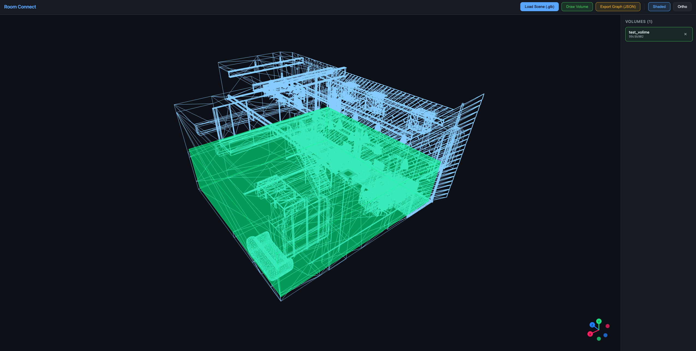

# Room Connect

An interactive web-based 3D application for interior scene analysis — define walkable areas, detect objects, place cameras, and render high-quality views via Blender Cycles.

## What It Does

Room Connect lets you load large 3D interior scenes (GLTF/GLB, tested up to 700MB) and perform three core tasks:

1. **Volume Connectivity** — Draw axis-aligned bounding boxes to define walkable areas, set up connectivity relationships between rooms/zones, and export the graph as JSON.

2. **Object Detection** — Filter scene meshes by name (e.g. "chair", "desk"), compute oriented bounding boxes (OOBBs), visualize them as 3D overlays, cull nested duplicates, and export object data.

3. **Rendering** — Place cameras manually or automatically (with BVH-based collision avoidance), render from all viewpoints via Blender Cycles in the backend, and download results as a ZIP with color renders, depth maps, and camera parameters.

## Screenshots

.png)
*Object Detection: filtering by "chair" with oriented bounding boxes displayed around all matching meshes*

.png)
*Rendering: auto-placed cameras with viewpoint entropy maximization, shown in PBR shaded mode*


*Volume Connectivity: wireframe mode with a walkable volume defined*

.png)
*Drawing a new volume in normal-shaded mode with scale/translate handles*

## Tech Stack

| Layer | Technology |
|-------|-----------|
| Frontend | React + Three.js (React Three Fiber) |
| Build | Vite |
| Backend | Python / Flask / Blender BPY (Cycles) |
| Deployment | Docker / Docker Compose |

## Quick Start

```bash
# Clone and run
git clone https://github.com/Stability-AI/room-connect.git
cd room-connect
docker-compose up --build
```

Open **http://localhost:3000**

## Features

### Scene Visualization
- 5 shading modes: Normals, Wireframe, Diffuse, Texture (unlit albedo), Shaded (PBR + studio lighting)
- Orthographic/perspective toggle
- Handles scenes up to 700MB+ (loaded client-side via blob URL)

### Volume Connectivity
- Draw, translate, scale axis-aligned bounding boxes
- Name volumes and define connectivity relationships
- Double-click to re-edit existing volumes
- Export connectivity graph as JSON

### Object Detection
- Case-insensitive substring filtering (include/exclude modes)
- Incremental detection: multiple runs accumulate results (deduplicated)
- World-space OOBB computation with 3D wireframe overlays
- Cull nested/overlapping boxes with adjustable sensitivity (protects committed objects)
- Export detected objects as JSON

### Rendering Pipeline
- Blender Cycles via Docker (GPU-accelerated when available)
- Chunked file upload (10MB chunks, supports 700MB+ GLB files)
- Manual camera placement ("Place at View")
- Automatic camera placement (BVH proximity queries, floor detection, inside-mesh validation)
- Constrain to Volume: limit camera placement to a specific room (load connectivity graph or use session data)
- Viewpoint entropy maximization: orient cameras toward detected objects (load objects JSON or use session data)
- Session continuity: volumes and objects from earlier tabs available in Rendering without re-export
- Override FOV (20°–120°) with live viewport preview
- Override lighting with brightness control
- 32-bit EXR depth maps
- Real-time render log streaming (SSE)
- ZIP download with renders + depth maps + .blend file + camera intrinsics/extrinsics
- Dynamic frustum aspect ratio matching render dimensions
- Non-convergence dialog with actionable suggestions

## Documentation

- [User Guide](docs/USER_GUIDE.md) — Step-by-step usage instructions
- [Post-Mortem](docs/POST_MORTEM.md) — Technical implementation details and lessons learned

## Project Structure

```
room-connect/
├── backend/
│   ├── app.py                  # Flask API (upload, render SSE, file serving)
│   ├── rendering/
│   │   └── cycles_renderer.py  # Blender Cycles multi-camera renderer
│   ├── requirements.txt
│   └── Dockerfile
├── frontend/
│   ├── src/
│   │   ├── App.jsx             # Root state management
│   │   ├── components/         # React components (13 files)
│   │   ├── utils/              # Camera placement, object detection, upload
│   │   └── styles/App.css
│   ├── package.json
│   └── vite.config.js
├── docs/                       # Screenshots, user guide, post-mortem
├── docker-compose.yml          # Development multi-service setup
├── Dockerfile                  # Production single-container build
└── README.md
```

## Development

| Task | Command |
|------|---------|
| Start (Docker) | `docker-compose up --build` |
| Frontend only | `cd frontend && npm install && npm run dev` |
| Backend only | `cd backend && pip install -r requirements.txt && python app.py` |
| Production build | `docker build -t room-connect . && docker run -p 8080:8080 room-connect` |

## Troubleshooting

### GLB file fails to load / WebGL Context Lost

GLB files larger than ~1.5GB may crash the browser tab due to memory limits. The browser needs to hold the entire file as a blob URL plus Three.js allocates additional memory for geometry/textures. If you see "Failed to fetch" or "Context Lost" errors, reduce the GLB size by:
- Lowering texture resolution at export
- Using Draco/KTX2 compression
- Splitting into multiple smaller files

Tested working range: up to ~1GB GLB files.

### "Render Views" button greyed out / upload fails with 500

Large GLB files (300–700MB) accumulate in the Docker container. If the container disk fills up, uploads fail silently and `sceneFileId` never gets set.

**Fix:** Clean up old uploads inside the container:
```bash
docker-compose exec backend sh -c "rm -rf /tmp/room-connect-uploads/* /tmp/room-connect-renders/*"
```

Then reload the page and re-load the scene.

To prevent this, periodically prune Docker:
```bash
docker system prune -f
```
