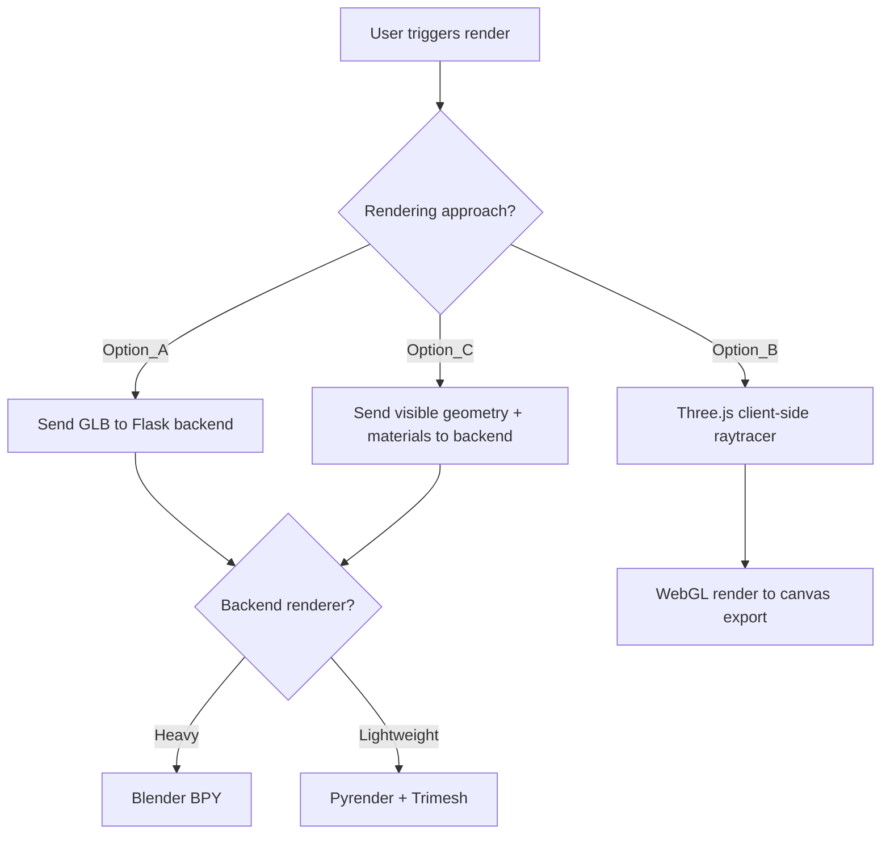
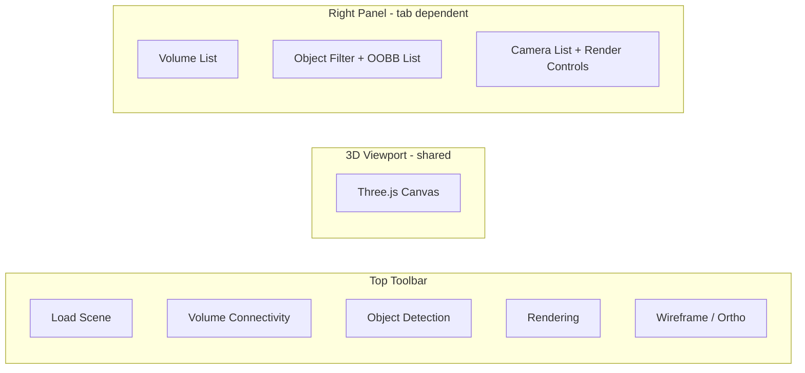

# Phase 2 — Plan of Record

## 1. Object Detection and OOBB Export

### Feature Description
Users can search/filter scene objects by name substring (e.g. exclude items containing `_furniture_` or `_chair_`). For each matched object, compute its Oriented Bounding Box (OOBB) in both local and world coordinates. Display OOBBs as 3D overlays and allow JSON export.

### Implementation

- Add a **search/filter input** (multi-string, comma-separated or tag-based) in the Object Detection tab
- On the frontend, traverse the loaded GLTF scene graph, filter meshes by name against user-provided include/exclude patterns
- For each matched mesh, compute the OOBB using Three.js `OBB` class (from `three/examples/jsm/math/OBB`) or compute from the mesh's bounding box + world matrix
- Render translucent OOBB wireframes around detected objects in the 3D view
- Export a JSON file structured as:

```json
{
  "scene": "filename.glb",
  "objects": [
    {
      "name": "Mesh_furniture_desk_01",
      "oobb": {
        "center": [x, y, z],
        "halfExtents": [hx, hy, hz],
        "rotation": [r00, r01, ..., r22]
      },
      "worldPosition": [x, y, z],
      "worldScale": [sx, sy, sz]
    }
  ]
}
```

### Key Decisions
- OOBB computation runs client-side (no backend needed) since the geometry is already in the browser
- Filtering is inclusive or exclusive based on user-specified substrings

---

## 2. Scene Rendering

### Feature Description
Generate rendered views of the scene from automatically or manually placed cameras that avoid collision with furniture. Views should maximize visibility of marked furniture (viewpoint entropy).

### Architecture Options (to be decided by user)



### Camera Placement Algorithm
Port the existing Trimesh-based safe camera sampling to the chosen backend:

- Detect floor plane (5th percentile of Y vertices)
- Sample positions within scene bounds at human eye-level height
- Validate each candidate:
  - Must be at least N units from nearest surface (proximity query)
  - Must maintain minimum spacing from other cameras
- Generate look-at matrices targeting scene center at waist height
- **Enhancement**: Add viewpoint entropy scoring — rank/filter views by how many labelled furniture items are visible (frustum + occlusion check)

### Camera Modes — IMPLEMENTED
- **Manual (Place at View)**: User navigates free-view camera, clicks "Place at View" to capture position/rotation as a render camera. Cameras shown as transparent pyramid frustums in 3D view. Double-click to switch to camera view, "Realign to View" to update, "Clear All" to remove all.
- **Auto-generated**: Algorithm places cameras using sampling logic (pending implementation)

### Backend Rendering — IMPLEMENTED (Blender BPY + Cycles)
- Decision: Use Blender BPY (Cycles renderer) via Docker
- GLB uploaded to backend via chunked streaming (Option B, verified with 700MB files)
- Flask SSE endpoint streams render logs in real-time to frontend debug console
- Renders from ALL placed cameras (color PNG + optional 32-bit EXR depth map)
- Materials rebuilt from glTF PBR data to match Three.js (selective repair for broken importer connections)
- Override lighting: 6 area lights + bright world environment, controllable brightness slider
- Output packaged as ZIP (optionally includes .blend file for inspection)
- Camera intrinsics/extrinsics exportable as JSON
- Y-up (Three.js) to Z-up (Blender) coordinate conversion for camera poses

### Frontend Rendering (deferred)
- **Reference implementation**: [THREE.js-PathTracing-Renderer — glTF Viewer](https://erichlof.github.io/THREE.js-PathTracing-Renderer/GLTF_Model_Viewer.html) — potential future client-side path-tracing option

---

## 3. UI Enhancements — Tabbed Interface

### Layout



### Tab Descriptions — IMPLEMENTED

| Tab | 3D Overlay | Side Panel | Actions |
|-----|-----------|-----------|---------|
| Volume Connectivity (default) | Volumes + handles | Volume list | Draw, edit, export graph JSON |
| Object Detection | OOBBs around filtered objects | Search input + object list + cull slider | Filter, toggle/cull OOBBs, export object JSON |
| Rendering | Camera frustum pyramids | Camera list + render settings + debug console | Place/realign/clear cameras, render all views, export ZIP + camera JSON |

### Shading Modes — IMPLEMENTED
5 modes in toolbar: Normals, Wireframe, Diffuse, Texture (unlit albedo), Shaded (PBR + studio lighting +15%)

### Implementation — COMPLETE
- `activeTab` state with `"connectivity"`, `"detection"`, `"rendering"`
- Shared 3D canvas; overlays toggle per active tab
- Components implemented:
  - `ObjectDetectionPanel.jsx` — filter UI, include/exclude mode, cull sensitivity dialog
  - `RenderingPanel.jsx` — camera placement, render settings, SSE log console, brightness slider
  - `OOBBOverlay.jsx` — 3D OOBB wireframe display
  - `CameraFrustum.jsx` — 3D transparent pyramid frustum visualization

---

## Open Questions

1. **Rendering approach**: Which option to pursue first — backend (BPY vs Pyrender+Trimesh) or frontend (Three.js screenshot)?
2. **Camera placement**: Should the entropy-based scoring be implemented in Phase 2 or deferred to Phase 3?
3. **Object filtering**: Should the filter support regex, or is simple substring matching sufficient?
