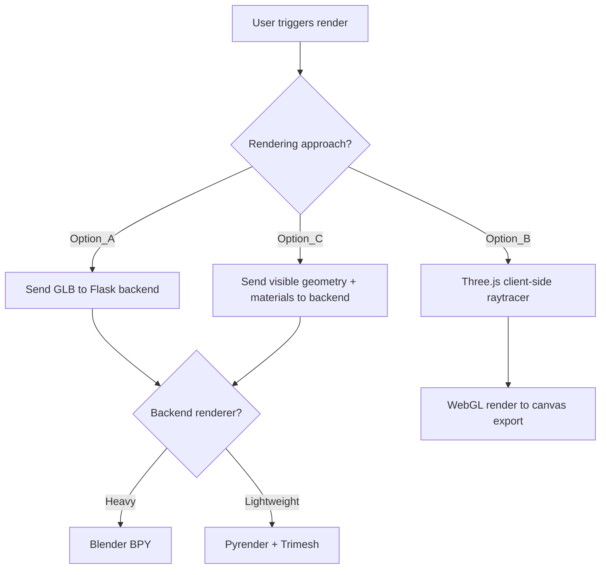
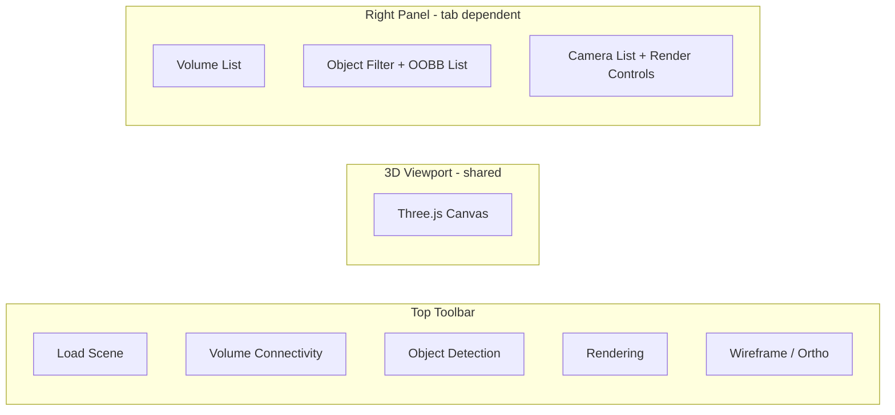

# Phase 2 — Plan of Record

## 1. Object Detection and OOBB Export

### Feature Description
Users can search/filter scene objects by name substring (e.g. exclude items containing `_furniture_` or `_chair_`). For each matched object, compute its Oriented Bounding Box (OOBB) in both local and world coordinates. Display OOBBs as 3D overlays and allow JSON export.

### Implementation

- Add a **search/filter input** (multi-string, comma-separated or tag-based) in the Object Detection tab
- On the frontend, traverse the loaded GLTF scene graph, filter meshes by name against user-provided include/exclude patterns
- For each matched mesh, compute the OOBB using Three.js `OBB` class (from `three/examples/jsm/math/OBB`) or compute from the mesh's bounding box + world matrix
- Render translucent OOBB wireframes around detected objects in the 3D view
- Export a JSON file structured as:

```json
{
  "scene": "filename.glb",
  "objects": [
    {
      "name": "Mesh_furniture_desk_01",
      "oobb": {
        "center": [x, y, z],
        "halfExtents": [hx, hy, hz],
        "rotation": [r00, r01, ..., r22]
      },
      "worldPosition": [x, y, z],
      "worldScale": [sx, sy, sz]
    }
  ]
}
```

### Key Decisions
- OOBB computation runs client-side (no backend needed) since the geometry is already in the browser
- Filtering is inclusive or exclusive based on user-specified substrings

---

## 2. Scene Rendering

### Feature Description
Generate rendered views of the scene from automatically or manually placed cameras that avoid collision with furniture. Views should maximize visibility of marked furniture (viewpoint entropy).

### Architecture Options (to be decided by user)



### Camera Placement Algorithm
Port the existing Trimesh-based safe camera sampling to the chosen backend:

- Detect floor plane (5th percentile of Y vertices)
- Sample positions within scene bounds at human eye-level height
- Validate each candidate:
  - Must be at least N units from nearest surface (proximity query)
  - Must maintain minimum spacing from other cameras
- Generate look-at matrices targeting scene center at waist height
- **Enhancement**: Add viewpoint entropy scoring — rank/filter views by how many labelled furniture items are visible (frustum + occlusion check)

### Camera Modes
- **Auto-generated**: Algorithm places cameras using the sampling logic above
- **Manual**: User clicks in the 3D view to place camera markers, sets look-at target

### Backend Rendering (if chosen)
- New Flask endpoint `POST /api/render` accepting scene data + camera poses
- Backend loads geometry via Trimesh or BPY
- Returns rendered image(s) as PNG/JPEG
- Dockerfile updated with rendering dependencies (pyrender/trimesh or Blender)

### Frontend Rendering (if chosen)
- Use Three.js `WebGLRenderer` to capture views (`renderer.domElement.toDataURL()`)
- No backend round-trip needed, but limited to rasterization (no path-tracing)
- **Reference implementation**: [THREE.js-PathTracing-Renderer — glTF Viewer](https://erichlof.github.io/THREE.js-PathTracing-Renderer/GLTF_Model_Viewer.html) — use as starting point for client-side path-traced rendering of GLB scenes

---

## 3. UI Enhancements — Tabbed Interface

### Layout



### Tab Descriptions

| Tab | 3D Overlay | Side Panel | Actions |
|-----|-----------|-----------|---------|
| Volume Connectivity (default) | Volumes + handles | Volume list | Draw, edit, export graph JSON |
| Object Detection | OOBBs around filtered objects | Search input + object list | Filter, toggle OOBBs, export object JSON |
| Rendering | Camera markers + frustum previews | Camera list + render settings | Place cameras, generate views, download renders |

### Implementation
- Add a `activeTab` state in `App.jsx` with values: `"connectivity"`, `"detection"`, `"rendering"`
- Tab buttons in the toolbar switch the active tab
- The 3D canvas is shared; overlays change based on active tab
- The right side panel renders different content per tab
- New components:
  - `frontend/src/components/ObjectDetection.jsx` — filter UI + object list
  - `frontend/src/components/RenderingPanel.jsx` — camera controls + render triggers
  - `frontend/src/components/OOBBOverlay.jsx` — 3D OOBB wireframe display
  - `frontend/src/components/CameraMarker.jsx` — 3D camera frustum preview

---

## Open Questions

1. **Rendering approach**: Which option to pursue first — backend (BPY vs Pyrender+Trimesh) or frontend (Three.js screenshot)?
2. **Camera placement**: Should the entropy-based scoring be implemented in Phase 2 or deferred to Phase 3?
3. **Object filtering**: Should the filter support regex, or is simple substring matching sufficient?
