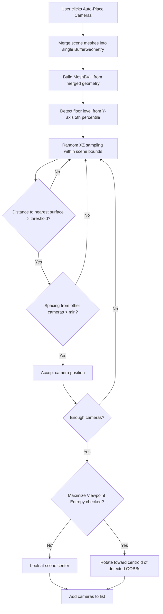

# Phase 2 Sub-POR: Auto Camera Placement (Frontend)

## Approach

Run the entire camera placement algorithm in the browser using `three-mesh-bvh` (already available via `@react-three/drei`). The scene geometry is already loaded — no backend round-trip needed. Generated cameras are added to the existing camera list and rendered via the existing Blender pipeline.

## Algorithm

## Implementation Details

### New file: `frontend/src/utils/cameraPlacement.js`

- `mergeSceneGeometries(scene)` — traverse GLTF scene, collect all mesh geometries, apply world matrices, merge into single `BufferGeometry`
- `buildSceneBVH(mergedGeometry)` — construct `MeshBVH`
- `detectFloorLevel(geometry)` — 5th percentile of Y-axis vertex positions
- `generateCameraPositions({ bvh, bounds, floorY, count, minDistance, minSpacing, eyeHeight })` — sampling loop with proximity + spacing validation
- `orientCameras(cameras, detectedObjects)` — if entropy maximization enabled, compute centroid of all detected OOBB centers, rotate each camera to face the direction that maximizes object visibility (weighted by number of OOBB centers within the camera's FOV cone)

### Viewpoint Entropy Maximization

When "Maximize Viewpoint Entropy" is checked:
1. Gather all detected OOBB centers from the Object Detection tab
2. For each generated camera, compute a look-at direction toward the cluster centroid of visible objects
3. Score candidate rotations by counting how many OOBB centers fall within the camera's view frustum
4. Select the rotation that maximizes the count
5. Only rotation is adjusted — position stays fixed
6. FOV adjustment may be considered in a future iteration

### Frontend UI Changes (`frontend/src/components/RenderingPanel.jsx`)

- "Auto-Place Cameras" button triggers the algorithm
- Add checkbox: "Maximize Viewpoint Entropy" (appears next to auto-place controls)
- When clicked, runs the algorithm and appends results to the existing camera list
- Generated cameras appear as frustums in the 3D view (reuses existing `CameraFrustum` component)

### State Flow (`frontend/src/App.jsx`)

- Pass `detectedObjects` to the RenderingPanel (needed for entropy calculation)
- Pass the Three.js scene ref (needed for geometry merging)
- Auto-placed cameras are added to the same `cameras` array as manually placed ones

### Parameters (exposed in UI)

- Camera count (existing input, default 10)
- Min distance from surface: 5.0 units (hardcoded initially, can expose later)
- Min spacing between cameras: 1.3 units (hardcoded initially)
- Eye height above floor: 1.6 units (human standing eye level)

### Dependencies

- `three-mesh-bvh` — already installed (transitive via `@react-three/drei`)
- `BufferGeometryUtils.mergeGeometries` — from `three/examples/jsm/utils/BufferGeometryUtils`

## What stays unchanged

- Backend rendering pipeline (receives camera positions as before)
- Manual "Place at View" (still works independently)
- Camera list, frustum visualization, export — all reused
