# Phase 2 Sub-POR: Large GLB Upload Feasibility (Frontend to Backend)

## Verdict: Yes, it is feasible with the right approach

Streaming a 500MB-700MB GLB file from the browser to the Flask backend is technically achievable and has been done in production for files up to 22GB (Zenodo). However, it requires specific configuration at every layer. Below is the full analysis.

---

## Key Difference from the Previous Problem

Previously, the bottleneck was **backend-to-frontend** (serving a 700MB file for Three.js to parse via HTTP). That was solved by loading the file directly from disk via `URL.createObjectURL()`.

The **frontend-to-backend** direction is different: the file already exists in browser memory (the user selected it), and we're sending it to a known local Docker service. This is fundamentally a simpler network path.

---

## Architecture Options

```mermaid
flowchart TD
    subgraph optionA [Option A: Shared Volume]
        User[User selects GLB] --> FE_Save[Frontend saves to shared Docker volume]
        FE_Save --> Backend_Read[Backend reads from volume]
    end

    subgraph optionB [Option B: Streamed Upload]
        User2[User selects GLB] --> Chunked[Frontend sends chunked upload]
        Chunked --> Flask_Stream[Flask reads from request.stream]
        Flask_Stream --> Disk_Write[Write to disk in chunks]
    end

    subgraph optionC [Option C: Direct File Path]
        User3[User selects GLB] --> Path_Send[Frontend sends file path only]
        Path_Send --> Backend_Load["Backend reads from bind-mounted host path"]
    end
```



---

## Option A: Shared Docker Volume (Recommended for local/dev)

Since both frontend and backend run in Docker via `docker-compose.yml`, they can share a named volume. The flow:

1. User selects GLB in browser (already works via blob URL for Three.js)
2. Frontend also uploads the file to the backend (one-time transfer)
3. Backend saves to the shared `uploads` volume
4. Backend processing (Trimesh/BPY) reads directly from disk

The current `docker-compose.yml` already has this:

```yaml
volumes:
  - uploads:/tmp/room-connect-uploads
```

Both services can mount this volume. The file only needs to be uploaded once, then is available for all subsequent processing calls.

---

## Option B: Chunked Streaming Upload (Recommended for production)

### How it works

- Frontend slices the file into 5-10MB chunks using `Blob.slice()`
- Each chunk is sent via XHR (for progress tracking) or fetch
- Backend appends chunks to disk using `request.stream` (never buffers full file in memory)
- Memory usage stays constant at ~13MB regardless of file size

### Required configuration changes

| Layer | Setting | Value |
|-------|---------|-------|
| Flask | `MAX_CONTENT_LENGTH` | Remove or set to `None` (no limit) |
| Gunicorn | `--timeout` | 600 (10 minutes for slow uploads) |
| Gunicorn | `--worker-class` | `gthread` or `gevent` (non-blocking) |
| Docker | Container memory | Ensure 512MB+ available |
| Vite proxy | No limit needed | Dev proxy passes through transparently |

### Backend streaming endpoint (no memory buffering)

```python
@app.route("/api/upload-scene", methods=["POST"])
def upload_scene_stream():
    filename = request.headers.get("X-Filename", "scene.glb")
    save_path = UPLOAD_DIR / f"{uuid.uuid4()}_{secure_filename(filename)}"
    
    with open(save_path, "wb") as f:
        while True:
            chunk = request.stream.read(1024 * 1024)  # 1MB at a time
            if not chunk:
                break
            f.write(chunk)
    
    return jsonify({"path": str(save_path), "size": save_path.stat().st_size})
```

### Frontend chunked upload

```javascript
async function uploadGLB(file, onProgress) {
  const CHUNK_SIZE = 10 * 1024 * 1024; // 10MB
  const totalChunks = Math.ceil(file.size / CHUNK_SIZE);
  
  for (let i = 0; i < totalChunks; i++) {
    const chunk = file.slice(i * CHUNK_SIZE, (i + 1) * CHUNK_SIZE);
    await fetch("/api/upload-chunk", {
      method: "POST",
      headers: {
        "X-Filename": file.name,
        "X-Chunk-Index": i,
        "X-Total-Chunks": totalChunks,
      },
      body: chunk,
    });
    onProgress((i + 1) / totalChunks);
  }
  
  const res = await fetch("/api/upload-merge", {
    method: "POST",
    headers: { "Content-Type": "application/json" },
    body: JSON.stringify({ filename: file.name, totalChunks }),
  });
  return res.json();
}
```

---

## Option C: Bind Mount with File Path (Simplest for local dev)

If running locally (not in Docker), the backend can simply accept the file path and read it directly from the host filesystem. This avoids any upload entirely but only works when frontend and backend share the same host.

---

## Potential Bottlenecks and Mitigations

| Bottleneck | Impact | Mitigation |
|-----------|--------|-----------|
| Gunicorn worker timeout (default 30s) | Worker killed mid-upload | Set `--timeout 600` |
| Flask `request.files` buffering | Entire file loaded to RAM | Use `request.stream` instead |
| Browser memory during upload | Tab crash on low-RAM machines | Chunked `Blob.slice()` keeps memory O(chunk_size) |
| Docker container memory limit | OOM kill | Stream to disk, never buffer; set container memory to 1GB+ |
| Network speed (Docker internal) | Slow transfer | Docker bridge network is effectively localhost speed (~1GB/s) |
| Concurrent uploads blocking workers | Other API calls stall | Use `gthread` workers or separate upload from API |

---

## Recommendation

For this project (local Docker deployment, single user):

1. **Use Option B (chunked upload)** for robustness and progress feedback
2. The file is uploaded once when the user clicks "Load Scene"
3. Store the file path; subsequent processing calls (camera placement, rendering) reference the already-saved file
4. The upload happens in parallel with the Three.js scene loading (the browser blob URL is independent)

### Implementation effort

- Backend: ~30 lines (streaming endpoint + merge logic)
- Frontend: ~40 lines (chunked upload with progress bar)
- Docker config: increase Gunicorn timeout, add gthread workers
- Total: approximately 1-2 hours of work

---

## Conclusion

A 500-700MB GLB **can** be reliably streamed to the backend without problems, provided you:
- Stream to disk (never buffer the full file in memory)
- Increase Gunicorn timeout to 600s
- Use chunked upload from the frontend for progress and reliability
- Both containers already share a volume for the saved file

The Docker internal network between containers is effectively localhost, so transfer speed is limited only by disk I/O (typically 200-500MB/s on SSD), meaning a 700MB file transfers in 2-4 seconds once the upload begins.
